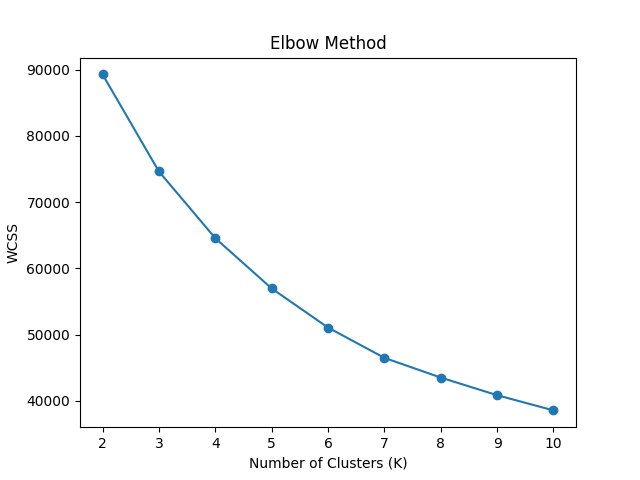
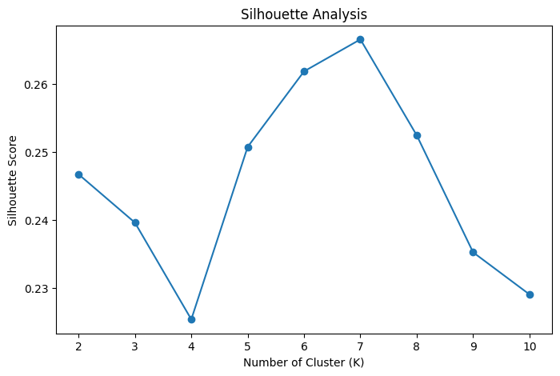
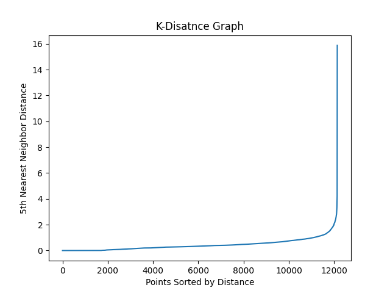
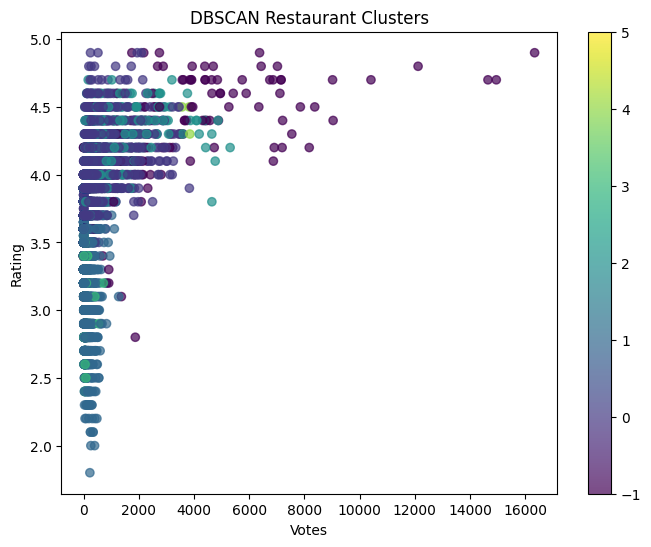
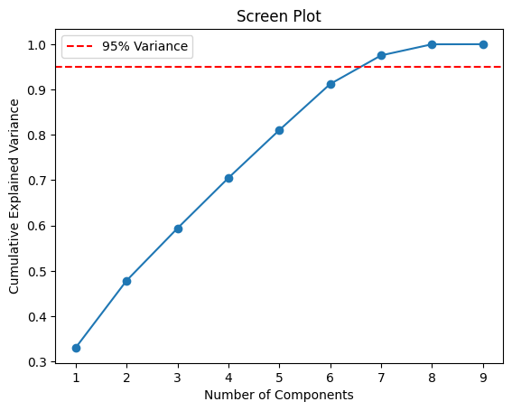
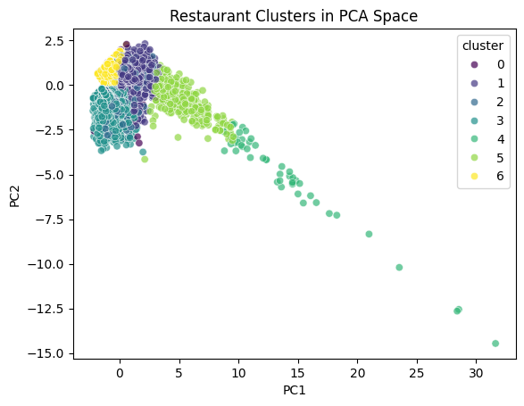

# Zomato Customer Segmentation


---

# Project Overview

This project applies unsupervised machine learning techniques to segment Hyderabad restaurants based on pricing, popularity, engagement, and customer behavior.

The project demonstrates:

- K-Means clustering
- DBSCAN anomaly detection
- PCA dimensionality reduction
- Restaurant segmentation
- Business interpretation of clusters
- Feature engineering
- Data visualization

The objective was to discover meaningful restaurant business segments and identify anomalous restaurant behavior using clustering techniques.

---

# Dataset

Dataset:
- Hyderabad Zomato Restaurant Dataset

Features engineered during preprocessing:

- popularity_score
- locality_avg_rating
- above_locality_avg
- cuisine_count
- rest_type_count
- log_votes

---

# Project Structure

```text
Zomato_Customer_Segmentation/
│
├── data/
│   ├── raw/
│   └── processed/
│
├── notebooks/
│   ├── 01_kmeans_segmentation.ipynb
│   ├── 02_dbscan.ipynb
│   └── 03_pca_visualization.ipynb
│
├── models/
│   ├── kmeans_model.pkl
│   └── dbscan_model.pkl
│
├── images/
│   ├── elbow_plot.png
│   ├── silhouette_scores.png
│   ├── k_distance_graph.png
│   ├── dbscan_clusters.png
│   ├── scree_plot.png
│   └── pca_clusters.png
│
├── reports/
│
├── README.md
├── requirements.txt
└── .gitignore
```

---

# Feature Engineering

The following engineered features were created to improve clustering quality:

| Feature             | Purpose                      |
| ------------------- | ---------------------------- |
| popularity_score    | Combined engagement metric   |
| locality_avg_rating | Locality-level benchmark     |
| above_locality_avg  | Relative restaurant quality  |
| cuisine_count       | Cuisine diversity            |
| rest_type_count     | Restaurant type diversity    |
| log_votes           | Normalized engagement metric |

These engineered features improved cluster separability and business interpretation.

---

# K-Means Customer Segmentation

K-Means clustering was used to group restaurants into meaningful business segments.

Features used for clustering:

* rate
* votes
* approx_cost
* popularity_score
* locality_avg_rating
* above_locality_avg
* cuisine_count
* rest_type_count
* log_votes

---

# Elbow Method

The Elbow Method was used to identify the optimal number of clusters.



---

# Silhouette Analysis

Silhouette analysis measured cluster cohesion and separation quality.



---

# Optimal Cluster Selection

K = 7 was selected because:

* it achieved the highest silhouette score
* elbow analysis showed diminishing WCSS improvements
* the clusters produced meaningful business interpretations

---

# Restaurant Segments

| Cluster | Business Interpretation              |
| ------- | ------------------------------------ |
| 0       | Expensive low-popularity restaurants |
| 1       | Popular affordable restaurants       |
| 2       | Diversified mid-tier restaurants     |
| 3       | Low performing restaurants           |
| 4       | Viral premium restaurants            |
| 5       | Highly popular premium restaurants   |
| 6       | Hidden or new restaurants            |

---

# DBSCAN Anomaly Detection

DBSCAN was applied to:

* identify density-based clusters
* detect anomalous restaurants
* analyze unusual restaurant behavior

Unlike K-Means, DBSCAN can naturally identify noise points and outliers.

---

# K-Distance Graph

The k-distance graph was used to estimate the optimal eps value for DBSCAN.



---

# DBSCAN Cluster Visualization



---

# PCA Dimensionality Reduction

Principal Component Analysis (PCA) was applied to:

* reduce dimensionality
* preserve variance
* visualize clusters in lower-dimensional space

---

# Scree Plot

The scree plot was used to determine the number of principal components required to preserve variance.



---

# PCA Cluster Visualization

Restaurants visualized in 2D PCA space.



---

# Key Business Insights

Key findings from segmentation analysis:

* Viral premium restaurants formed isolated high-engagement clusters.
* Affordable restaurants achieved strong popularity and customer engagement.
* Premium pricing alone did not guarantee popularity.
* Hidden/new restaurants showed extremely low engagement patterns.
* DBSCAN successfully identified anomalous restaurant behavior.
* Restaurant diversity and cuisine diversity influenced cluster structure.

---

# Technologies Used

* Python
* Pandas
* NumPy
* Matplotlib
* Seaborn
* Scikit-learn
* Joblib

---

# Installation

## Clone Repository

```bash
git clone <your-github-repo-link>
```

---

## Install Dependencies

```bash
pip install -r requirements.txt
```

---

## Run Jupyter Notebook

```bash
jupyter notebook
```

---

# requirements.txt

```text
pandas
numpy
matplotlib
seaborn
scikit-learn
joblib
jupyter
```

---

# Future Improvements

Potential future upgrades:

* HDBSCAN clustering
* UMAP visualization
* Streamlit dashboard
* Restaurant recommendation engine
* Time-series restaurant trend analysis
* Geospatial clustering analysis

---

# Key Learning Outcomes

This project demonstrates:

* Unsupervised Machine Learning
* Clustering algorithms
* Density-based anomaly detection
* Dimensionality reduction
* Feature engineering
* Business interpretation of ML outputs
* Data visualization
* Portfolio-quality project organization

---

# Author

Mohammed Mateen

Machine Learning & Data Science Portfolio Project

---

# License

This project is licensed for educational and portfolio use.

```
```
